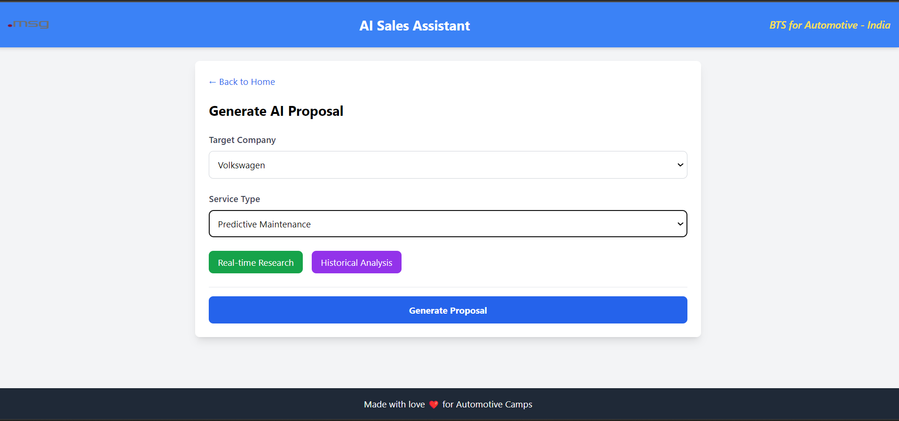

# AI Sales Assistant for Automotive Companies

Open Source like mit for now.. I'll maybe do the repo private later 

## Overview

The AI Sales Assistant is a web application designed to help sales teams in the automotive industry generate tailored proposals, conduct market analysis, and gain customer insights using advanced AI and LangGraph. This project leverages React, Tailwind CSS, and LangChain's LangGraph to provide a powerful and intuitive user experience.

## Features

-   **AI Proposal Generator:** Create customized proposals for automotive companies based on selected services and company details.
-   **Real-time Research:** Conduct instant research on target companies to gather the latest information.
-   **Historical Analysis:** Analyze historical data to identify trends and patterns.
-   **Market Analysis (Coming Soon):** Future feature to analyze market trends and competitor strategies.
-   **Customer Insights (Under Development):** Future feature to gain deep insights into customer behavior and preferences.
-   **Lead Generation (Future Release):** Future feature to identify and qualify potential leads.
-   **PDF Export:** Download generated proposals as PDF documents.
-   **Copy to Clipboard:** Easily copy proposal text to the clipboard.
- **Responsive Design:** The application is designed to work seamlessly on various screen sizes.

## Technologies Used

-   **React:** A JavaScript library for building user interfaces.
-   **Tailwind CSS:** A utility-first CSS framework for rapid UI development.
-   **LangChain/LangGraph:** A framework for building applications with large language models.
-   **jsPDF:** A library for generating PDF documents.
-   **Webpack:** A module bundler for JavaScript applications.
- **Node.js:** A JavaScript runtime environment.

## Getting Started

### Prerequisites

-   Node.js (v18 or later)
-   npm (or yarn)

### Installation

1.  Clone the repository:

    ```bash
    git clone <repository-url>
    ```

2.  Navigate to the project directory:

    ```bash
    cd auto-assist
    ```

3.  Install dependencies:

    ```bash
    npm install
    ```

### Running the Application

1.  Start the development server:

    ```bash
    npm start
    ```

2.  Open your browser and go to `http://localhost:3000`.

### Home Page




